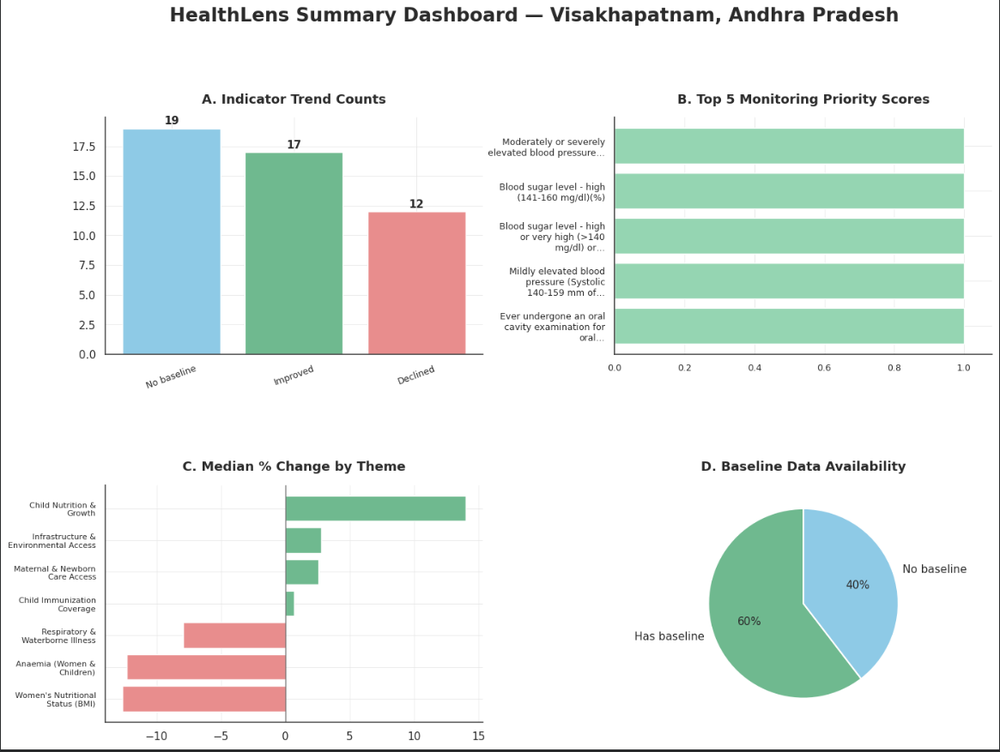

# BaselineIQ
### A Sentinel for Public Health Trends

---

## Why this project?

Our generation has witnessed an extraordinary surge in technology, industrialization, urbanization, and digital connectivity. While these advancements have undeniably improved quality of life, they have also quietly reshaped our health in ways that often go unnoticed.

From increasing lifestyle diseases to changing nutritional patterns, respiratory illnesses, and access to healthcare, public health is constantly evolving. Yet, these shifts are often buried inside enormous national survey datasets that few people ever explore.

This project was built to answer a simple question:

> **Can we transform thousands of rows of public health survey data into something that immediately highlights where attention is needed?**

BaselineIQ is a reproducible data analytics workflow that compares **NFHS-4** and **NFHS-5** district-level health indicators, identifies meaningful changes over time, prioritizes indicators requiring monitoring, and presents the findings through publication-ready visualizations.

Rather than predicting the future, BaselineIQ focuses on understanding the present—because informed decisions begin with reliable evidence.

---

# Workflow

<p align="center">
  
</p>

---

# Dashboard Preview

<p align="center">
  
</p>

---

# What BaselineIQ Does

Starting from raw National Family Health Survey (NFHS) data, the notebook automatically:

- Loads and cleans district-level survey data
- Standardizes health indicators across survey rounds
- Groups indicators into public health themes
- Compares NFHS-4 and NFHS-5 values
- Calculates absolute and percentage changes
- Identifies improving and declining indicators
- Generates monitoring priority scores
- Performs SQL-based validation queries
- Produces publication-ready visualizations

Everything runs inside a single Google Colab notebook without requiring any local installation.

---

# Dataset

**Source**

National Family Health Survey (NFHS)

District-level indicators from:

- NFHS-4
- NFHS-5

The notebook currently demonstrates the workflow using **Visakhapatnam, Andhra Pradesh**, although the pipeline is designed to be reusable for any district with compatible data.

---

# Technologies Used

| Category | Tools |
|----------|-------|
| Language | Python |
| Notebook | Google Colab |
| Data Manipulation | Pandas, NumPy |
| Visualisation | Matplotlib |
| SQL | SQLite3 |
| Data Processing | Regular Expressions, Custom Rule-Based Mapping |

---

# Analytical Workflow

The notebook follows a structured analytical pipeline rather than isolated scripts.

## 1. Data Preparation

- Load district-level survey data
- Clean missing values
- Standardize indicator names
- Convert percentage values into numerical format

---

## 2. Indicator Classification

Indicators are grouped into meaningful public health themes such as:

- Maternal Health
- Child Nutrition
- Immunization
- Infrastructure & Environmental Access
- Women's Health
- Respiratory & Waterborne Diseases

This enables both indicator-level and theme-level analysis.

---

## 3. Trend Analysis

For every indicator, the notebook computes:

- NFHS-4 value
- NFHS-5 value
- Absolute change
- Percentage change
- Improvement or decline

These metrics provide an interpretable picture of district-level health trends.

---

## 4. Monitoring Priority Scoring

Not every declining indicator deserves equal attention.

BaselineIQ assigns a monitoring priority score based on:

- Direction of change
- Magnitude of change
- Baseline availability

This creates a shortlist of indicators that may warrant closer monitoring.

---

## 5. SQL Validation

To demonstrate analytical versatility, selected outputs are loaded into an in-memory SQLite database.

Example operations include:

- GROUP BY
- HAVING
- JOIN
- Common Table Expressions (CTEs)
- Window Functions (RANK())

These SQL queries validate the analytical results generated in Python.

---

# Visual Outputs

The notebook automatically generates publication-ready figures including:

### Health Summary Dashboard

- Indicator trend counts
- Monitoring priorities
- Median percentage change by theme
- Baseline availability

---

### Percentage Change Heatmap

Displays indicator-level percentage changes across public health themes using robust colour normalization to reduce the influence of extreme outliers.

---

### Top Improvements

Highlights indicators with the largest positive changes between NFHS-4 and NFHS-5.

---

### Largest Declines

Highlights indicators requiring greater monitoring attention.

---

# Repository Structure

```
BaselineIQ/
│
├── BaselineIQ.ipynb
├── data/
│   └── nfhs_district_data.csv
├── images/
│   ├── workflow.png
│   ├── dashboard.png
│   ├── heatmap.png
│   ├── improvements.png
│   └── declines.png
├── README.md
└── LICENSE
```

---

# Design Principles

A few decisions guided the development of this notebook:

- Reproducibility over complexity
- Readability over cleverness
- Transparent calculations over black-box methods
- Clear storytelling through visualization
- Modular code that can be adapted to other districts

---

# Future Improvements

Potential extensions include:

- Interactive dashboards (Plotly or Streamlit)
- District-to-district comparisons
- State-wide trend analysis
- Automated report generation
- Time-series modelling with future survey rounds
- Geospatial visualization using district maps

---

# A Small Note

This project was built as a portfolio exercise to explore how public health survey data can be transformed into clear, reproducible analytical insights.

While the workflow focuses on a single district for demonstration, the analytical pipeline was intentionally designed to be adaptable, transparent, and easy to extend.

Sometimes the most valuable insight isn't hidden inside a sophisticated machine learning model.

Sometimes it's already sitting quietly inside a public dataset—waiting to be noticed.

---

If you found this project interesting, feel free to explore the notebook, suggest improvements, or build upon the workflow.
